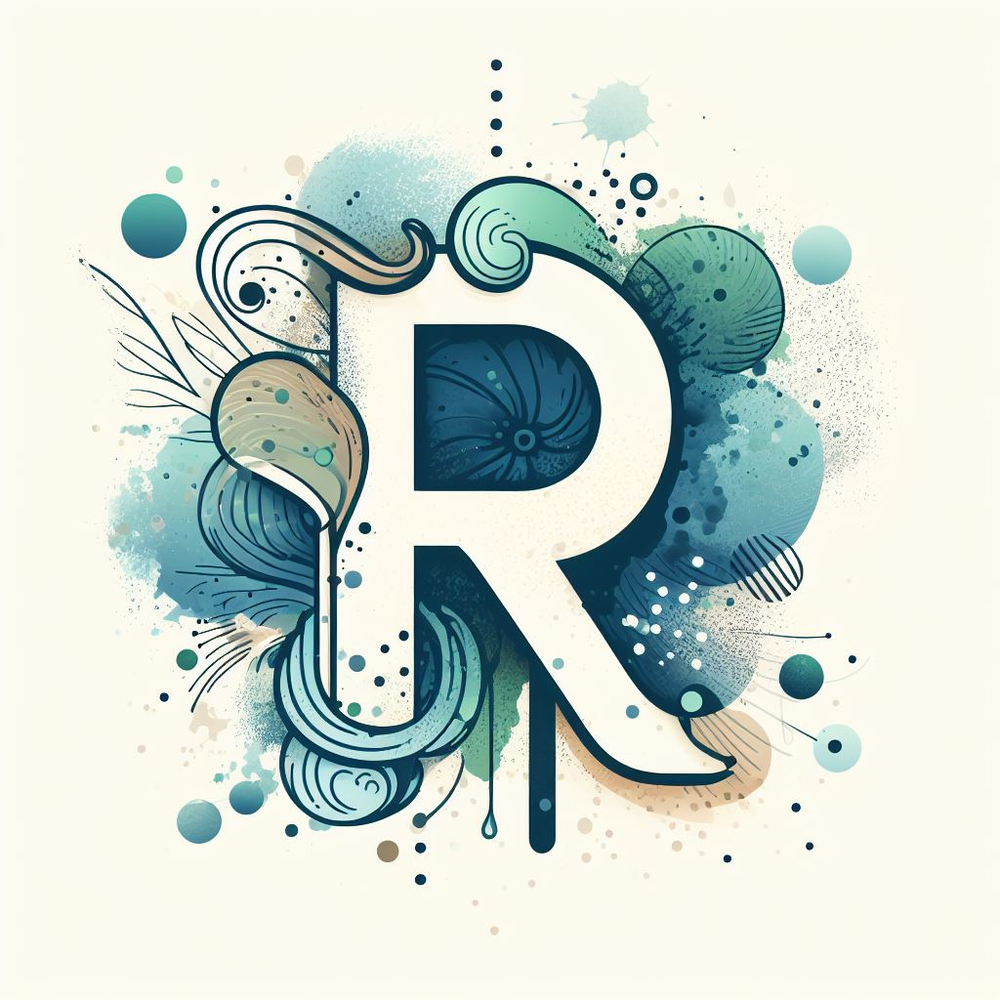

<!-- Improved compatibility of back to top link: See: https://github.com/othneildrew/Best-README-Template/pull/73 -->
<a name="readme-top"></a>
<!--
*** Thanks for checking out the Best-README-Template. If you have a suggestion
*** that would make this better, please fork the repo and create a pull request
*** or simply open an issue with the tag "enhancement".
*** Don't forget to give the project a star!
*** Thanks again! Now go create something AMAZING! :D
-->


<!-- PROJECT SHIELDS -->
<!--
*** I'm using markdown "reference style" links for readability.
*** Reference links are enclosed in brackets [ ] instead of parentheses ( ).
*** See the bottom of this document for the declaration of the reference variables
*** for contributors-url, forks-url, etc. This is an optional, concise syntax you may use.
*** https://www.markdownguide.org/basic-syntax/#reference-style-links
-->


<!-- PROJECT LOGO -->
<br />
<div align="center">
  <a href="https://receptorai.streamlit.app/">
    
  </a>

<h3 align="center">ReceptorAI</h3>

  <p align="center">
    Discover TCR matches, antigen specificity, and structure with AI
    <br />
    <br />
    <a href="https://receptorai.streamlit.app/">View Demo</a>
    ·
    <a href="https://github.com/naity/receptorai/issues">Report Bug</a>
    ·
    <a href="https://github.com/naity/receptorai/issues">Request Feature</a>
  </p>
</div>


<!-- TABLE OF CONTENTS -->
<details>
  <summary>Table of Contents</summary>
  <ol>
    <li>
      <a href="#about-the-project">About The Project</a>
      <ul>
        <li><a href="#built-with">Built With</a></li>
      </ul>
    </li>
    <li>
      <a href="#getting-started">Getting Started</a>
      <ul>
        <li><a href="#prerequisites">Prerequisites</a></li>
      </ul>
    </li>
    <li><a href="#usage">Usage</a></li>
    <li><a href="#contributing">Contributing</a></li>
    <li><a href="#license">License</a></li>
    <li><a href="#contact">Contact</a></li>
  </ol>
</details>


<!-- ABOUT THE PROJECT -->
## About The Project

[![ReceptorAI Screen Shot][product-screenshot]](https://receptorai.streamlit.app/)

[**ReceptorAI**](https://receptorai.streamlit.app/) is an AI-powered app that uses Transformer-based protein language models to help you identify T cell receptor (TCR) matches, discover antigen specificity, and predict TCR structure. ReceptorAI leverages embeddings to represent TCR sequences in a compact and informative way, allowing it to efficiently query a database of TCRs with known antigen specificity.


* 🔍 Efficiently identify TCR matches
* 💡 Discover TCR antigen specificity
* 🧩 Predict TCR structure


<p align="right">(<a href="#readme-top">back to top</a>)</p>


### Built With

* [![Python][Python_badge]][Python-url]
* [![Streamlit][Streamlit_badge]][Streamlit-url]
* [![Transformers][Transformers_badge]][Transformers-url]
* [![Chroma][Chroma_badge]][Chroma-url]
* [![ESM][ESM_badge]][ESM-url]


<p align="right">(<a href="#readme-top">back to top</a>)</p>


<!-- GETTING STARTED -->
## Getting Started

To launch the ReceptorAI web app, please follow the steps below:
1. Clone the repo:
```sh
git clone https://github.com/naity/ReceptorAI.git
```

2. Run the Streamlit app:
```sh
streamlit run app.py
```

### Prerequisites

The `requirements.txt` file lists the Python packages that need to be installed in order to run the app. Please use the command below for installation.
  ```sh
  pip install -r requirements.txt
  ```

<p align="right">(<a href="#readme-top">back to top</a>)</p>


<!-- USAGE EXAMPLES -->
## Usage

The ReceptorAI app can be run as is. However, users can also update or customize the embedding database for the app using the following Jupyter Notebooks:

1. **`antigen_specific_tcrs.ipynb`**: This notebook preprocesses TCR sequences from various public databases. Users can customize the TCRs they want to include in the database.

2. **`build_index.ipynb`**: Run this notebook after executing `antigen_specific_tcrs.ipynb` to transform  TCRs into vectors and build the embedding database for the ReceptorAI app. You may customize the underlying LLM for creating embeddings.

3. **`evaluation.ipynb`**: This notebook assesses the performance of the constructed TCR embedding database. TCRs used to build the database are queried against it, and the recall is 99.7%, indicating that the same TCR is returned 99.7% of the time.

<p align="right">(<a href="#readme-top">back to top</a>)</p>


<!-- CONTRIBUTING -->
## Contributing

Contributions are what make the open source community such an amazing place to learn, inspire, and create. Any contributions you make are **greatly appreciated**.

If you have a suggestion that would make this better, please fork the repo and create a pull request. You can also simply open an issue with the tag "enhancement".
Don't forget to give the project a star! Thanks again!

1. Fork the Project
2. Create your Feature Branch (`git checkout -b feature/AmazingFeature`)
3. Commit your Changes (`git commit -m 'Add some AmazingFeature'`)
4. Push to the Branch (`git push origin feature/AmazingFeature`)
5. Open a Pull Request

<p align="right">(<a href="#readme-top">back to top</a>)</p>


<!-- LICENSE -->
## License

Distributed under the MIT License. See `LICENSE.txt` for more information.

<p align="right">(<a href="#readme-top">back to top</a>)</p>


<!-- CONTACT -->
## Contact

<p align="left">
<a href="https://linkedin.com/in/ytiancompbio" target="blank"></a>
<a href="https://twitter.com/ytiancompbio" target="blank"></a>
<a href="https://medium.com/@yuan_tian" target="blank"></a>
<a href="https://www.youtube.com/c/ytiancompbio" target="blank"></a>
</p>

<p align="right">(<a href="#readme-top">back to top</a>)</p>


<!-- MARKDOWN LINKS & IMAGES -->
<!-- https://www.markdownguide.org/basic-syntax/#reference-style-links -->
[product-screenshot]: images/screenshot.gif
[Python_badge]: https://img.shields.io/badge/python-3670A0?style=for-the-badge&logo=python&logoColor=ffdd54
[Python-url]: https://www.python.org/
[Streamlit_badge]: https://img.shields.io/badge/Streamlit-20232A?style=for-the-badge&logo=Streamlit
[Streamlit-url]: https://streamlit.io/
[Chroma_badge]: https://img.shields.io/badge/Chroma-563D7C?style=for-the-badge
[Chroma-url]: https://www.trychroma.com/
[Transformers_badge]: https://img.shields.io/badge/%F0%9F%A4%97-Transformers-yellow?style=for-the-badge
[Transformers-url]: https://huggingface.co/docs/transformers/index
[ESM_badge]: https://img.shields.io/badge/ESM-blue?style=for-the-badge
[ESM-url]: https://github.com/facebookresearch/esm/
